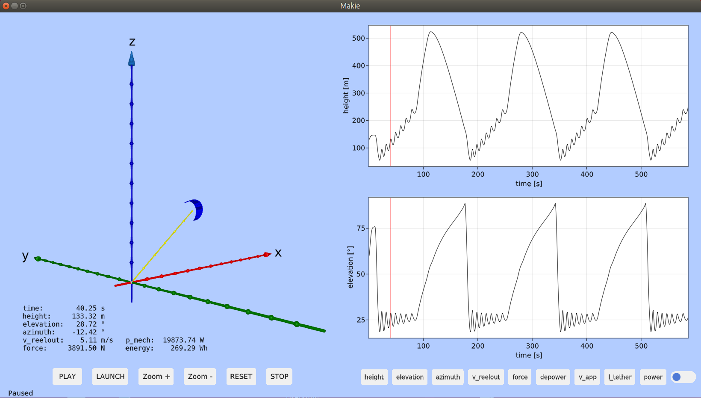

# KiteViewer
3D viewer for to visualize the flight path and power production of tethered wind drones and kites for airborne wind energy applications

<p align="center"></p>

## Requirements

Julia 1.6 or higher must be installed. You can download it at https://www.julialang.org/

On Linux or MAC you can install the latest Julia version with the following command:
```
bash -ci "$(curl -fsSL https://raw.githubusercontent.com/abelsiqueira/jill/master/jill.sh)"
```

At least a dual core PC or MAC with 4 GB RAM (min. 2 GB) is required. 
OpenGL, version 3.3 or higher must be working.

It should work on Windows, Linux and Mac, but until now only tested on Linux
(Ubuntu 18.04 and Ubuntu 20.04) and Windows 10.

If you are using Windows, read [Windows.md](./doc/Windows.md) first.

## Installation

After installing julia, create a work folder:

```
cd
mkdir repos
cd repos
```
Check out the source code:
```
git clone https://github.com/ufechner7/KiteViewer.git
cd KiteViewer
```

Launch Julia and install the dependencies:

```
julia --project
using Pkg
Pkg.instantiate()
Pkg.precompile()
```
The last two commands will need 3 min or more each to install and precompile all
required packages when using Julia 1.6 on Windows, longer with Julia 1.5 and shorter on Linux.

Run the program and show the GUI:

```
include("src/KiteViewer.jl")
main()
```

Click on PLAY to play the log file (and wait until the flight data import is finished when you do it the first time.) Use the right mouse button to zoom and the left mouse button to pan the 3D view. 

## Import flight data
When you run KiteViewer for the first time the flight data is imported
and converted to the .arrow format.

With the following commands you can import csv flight data manually:
```
./runjulia
include("src/Importer.jl")
```
If you have your own .csv log files you need to extend the importer
for your data format.

## Update from version 0.2
Run the following commands:
```
cd repos/KiteViewer
rm Manifest.toml
git pull
./create_sys_image.sh
```

## Fixing OpenGL problems
On a computer with Ubuntu 20.04 and Intel integrated graphics the following steps were needed to make OpenGL work:

```
sudo apt install libglfw3
cd ~/packages/julias/julia-1.5.3/lib/julia/
rm libstdc++.so.6 
```
After implementing this fix rebuild GLMakie with the following command from within Julia:

```
cd ~/repos/KiteViewer
julia --project
] 
build GLMakie
```

Removing the version of libstdc++.so.6 supplied with Julia is only needed for Julia versions older than 1.6.0 due to this bug: https://github.com/JuliaGL/GLFW.jl/issues/198

## Hacking the code
Use the package [Revise](https://timholy.github.io/Revise.jl/stable/) to speed up testing of code changes:
```
julia --project
using Revise
includet("src/KiteViewer.jl")
```
Please don't forget the t at end of the includet command.

Now make changes to KiteViewer.jl and then execute
```
main()
```
Revise is watching the file KiteViewer.jl, and each time a changed version is saved any changed function is recompiled, but only the function that was changed and nothing else, therefore this is much faster than restarting Julia after a change.

## Reducing the startup time
On Linux it can help to activate the "performance" governor. This can be done with the command: ``` sudo ./performance.sh```

Using a Julia system image that contains a precompiled version of the GUI library GLMakie.jl can drastically reduce the startup time. To create a system image just run the script: ```./create_sys_image.sh``` This needs to be done at least once, but also after important package updates because it freezes the package versions.

If you now use the script ./runjulia.sh the new system image with the precompiled packages will be used.
If you do not want to make changes to the code you can also run the app by typing ```./kiteviewer.sh```.

More detailed explaination here: [SystemImage.md](./doc/SystemImage.md)
(Tested on Windows10 and Linux.)

## Scientific background
See: [Research Fechner](https://research.tudelft.nl/en/publications/?search=Uwe+Fechner&pageSize=50&ordering=rating&descending=true) for the scientic background of this code.
