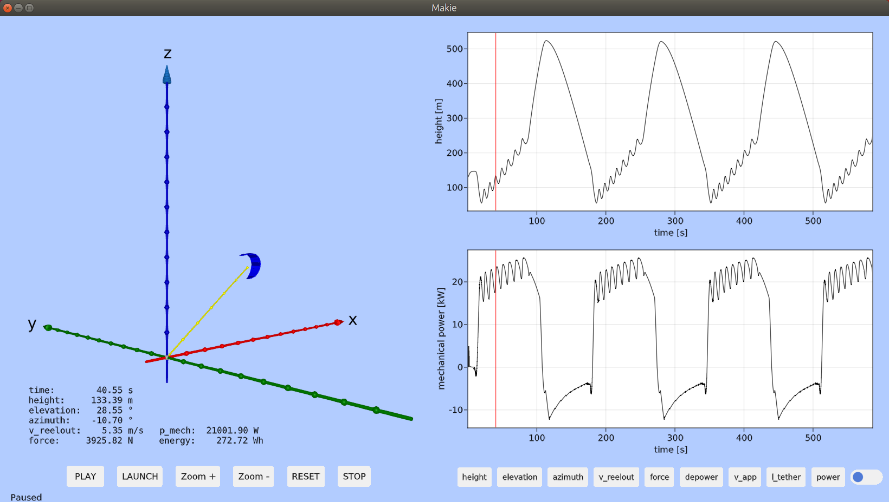

# KiteViewer
3D viewer and simulator for to visualize the flight path and power production of tethered wind drones and kites for airborne wind energy applications

<p align="center"></p>

## Requirements

Julia 1.6.x or 1.7.x must be installed. You can download it at https://www.julialang.org/

On Linux or MAC you can install the latest Julia version with the following command:
```
bash -ci "$(curl -fsSL https://raw.githubusercontent.com/abelsiqueira/jill/master/jill.sh)"
```

At least a dual core PC or MAC with 4 GB RAM (min. 2 GB) is required. 
OpenGL, version 3.3 or higher must be working.

It should work on Windows, Linux and Mac, but until now only tested on Linux
(Ubuntu 18.04 and Ubuntu 20.04) and Windows 10.

If you are using Windows, read [Windows.md](./doc/Windows.md) first.

## Installation

After installing julia, create a work folder:

```Bash
cd
mkdir repos
cd repos
```
Check out the source code:
```Bash
git clone https://github.com/ufechner7/KiteViewer.git
cd KiteViewer
```

Create a pre-compiled system image (needed for good performance):
```
./create_sys_image.sh
```
This takes about 10 to 15 minutes and needs to be done at least once, but also after important package updates because it freezes the package versions.


Run the program and show the GUI:

```Julia
./run_julia.sh
include("src/KiteViewer.jl")
main()
```

Click on PLAY to play the log file (and wait until the flight data import is finished when you do it the first time.) Use the right mouse button to zoom and the left mouse button to pan the 3D view. 

## Import flight data
When you run KiteViewer for the first time the flight data is imported
and converted to the .arrow format.

With the following commands you can import csv flight data manually:
```Julia
./run_julia.sh
include("src/Importer.jl")
```
If you have your own .csv log files you need to extend the importer
for your data format.

## Run the one point kite model
To start the simulation, click the button "START". To steer the kite, use the right and left cursor keys.
For a first test, after pressing the START button press the right cursor twice and wait. If you started the main function
from a Julia console you can see the setting of the steering as numbers in the console.

Not yet implemented: 1. changing the depower settings manually and 2. autopilot.

## Hacking the code
Use the package [Revise](https://timholy.github.io/Revise.jl/stable/) to speed up testing of code changes:
```Julia
./run_julia.sh
includet("src/KiteViewer.jl")
```
Please don't forget the t at end of the includet command.

Now make changes to KiteViewer.jl and then execute
```
main()
```
Revise is watching the file KiteViewer.jl, and each time a changed version is saved any changed function is recompiled, but only the function that was changed and nothing else, therefore this is much faster than restarting Julia after a change.

## Reducing the startup time
On Linux it can help to activate the "performance" governor. This can be done with the command: ``` sudo ./performance.sh```

If you use the script ./run_julia.sh the system image with the precompiled packages will be used.
If you do not want to make changes to the code you can also run the app by typing ```./kiteviewer.sh```.

More detailed explaination here: [SystemImage.md](./doc/SystemImage.md)
(Tested on Windows10 and Linux.)

## Tests of the Simulator
The simulator is tested against the results of the paper [Dynamic Model of a Pumping Kite Power System](http://arxiv.org/abs/1406.6218). For details of the tests see:  [Tests.md](./doc/Tests.md)


## References
- [Research Fechner](https://research.tudelft.nl/en/publications/?search=Uwe+Fechner&pageSize=50&ordering=rating&descending=true) for the scientic background of this code
- [KiteUtils](https://github.com/ufechner7/KiteUtils.jl) Julia package, used by this program